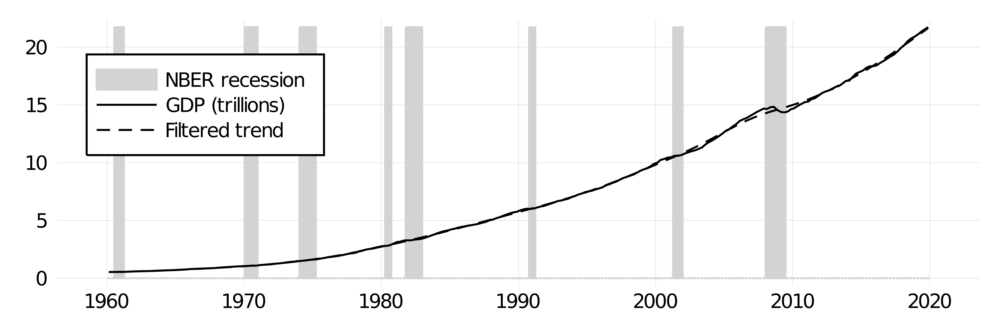
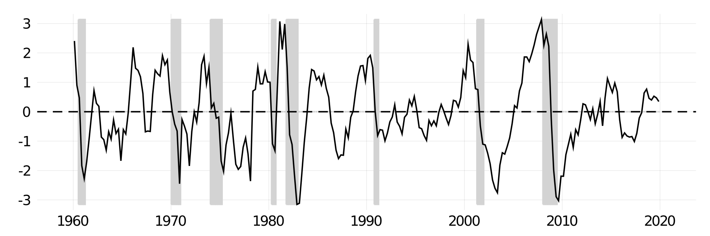

# Hodrick-Prescott filter with Julia

In this repository I have built a simple code for a Hodrick-Prescott filter<sup>[1](#footnote1)</sup> using Julia. The solution for


is given by (in matrix notation)<sup>[2](#footnote2)</sup>:


where


The code used is:

```julia
function hpfilter(y, w)
        t = size(y)[1]
        Q = zeros(t, t+2)
        H = zeros(t, t+2)
        for i in 1:t
                global
                Q[i, i] = 1
                Q[i, i+1] = -2
                Q[i, i+2] = 1
                H[i,i] = 1
        end
        output = (H'H + w * Q'Q)^(-1)*H'y
        output[1:t]
end

```
An example using GDP data from the US and "rule of thumb" smoothing parameter for quarterly data (1,600)<sup>[3](#footnote2)</sup> is provided:





<a name="footnote1">1</a>: R. Hodrick; E. Prescott (1997). ["Postwar U.S. Business Cycles: An Empirical Investigation"](https://www.jstor.org/stable/2953682?casa_token=1-uuRk3f6isAAAAA:M9iL4SdsO_j6Cx5FaYdilOGiUllq2vRxh2bKt7Hl84KR73ls0zfCmByqUQOGpN-wJ3wZG0wVIyitCNNyFScdR6Xv9h5msFMJmT7z91Kkcl-6huVf7A&seq=1#metadata_info_tab_contents). *Journal of Money, Credit, and Banking*.

<a name="footnote1">2</a>: R. Hodrick (2020). ["An Exploration of Trend-Cycle Decomposition Methodologies in Simulated Data".](https://www.nber.org/papers/w26750) *National Bureau of Economic Research*.

<a name="footnote1">3</a>: M. Ravn; H. Uhlig (2002). ["On adjusting the Hodrick–Prescott filter for the frequency of observations"](https://www.mitpressjournals.org/doi/10.1162/003465302317411604). *The Review of Economics and Statistics*.
